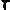

# Image Segmentation Using Maximum Flow / Minimum Cut

## Overview
This project implements an image segmentation algorithm using the Maximum Flow / Minimum Cut algorithm. The algorithm distinguishes the foreground and background in a given 10x10 black-and-white image.

## Example Results

### test1
|  |  |
|-----------------------------------|-------------------------------------|

### test2
|  |  |
|-----------------------------------|-------------------------------------|

### test3
|  |  |
|-----------------------------------|-------------------------------------|

### test4
|  |  |
|-----------------------------------|-------------------------------------|

## Input
- A 10x10 `.png` file named `test.png` containing a black-and-white image.

## Output
- A processed image file named `result.png`, where the foreground and background are clearly distinguished.

## Processing Steps
1. **Image to Graph Conversion:**
   - Each pixel in the image is represented as a node in a directed, weighted graph.
   - Every node is connected to its right and bottom neighbor.
   - Edge weights are determined by pixel intensity differences (greater intensity difference = lower capacity).

2. **Graph Construction:**
   - A **source node** is connected to every pixel in the first row with high-capacity edges.
   - A **sink node** is connected to every pixel in the last row with high-capacity edges.

3. **Flow Computation:**
   - The maximum flow algorithm is executed to determine the optimal segmentation.

4. **Minimum Cut Execution:**
   - The minimum cut is computed to separate the foreground from the background.
   - The result is a binary image where only black and white pixels remain.

## Implementation Details
- The algorithm processes a `10x10` PNG image.
- It constructs a directed graph representation of the image.
- It applies a **maximum flow algorithm** (e.g., Ford-Fulkerson or Edmonds-Karp) to segment the image.
- The **minimum cut** is used to classify pixels as foreground or background.
- The output is written to `result.png`.

## Dependencies
- OpenCV2 (Open Source Computer Vision Library)

## Usage
1. Place `test.png` in the project directory.
2. Run the application.
3. The output `result.png` will be generated.

## Possible improvements
- Implement support for larger images.
- Optimize graph construction for performance.
- Extend the algorithm to handle color images.
